# Markov Chains and Monte Carlo Simulation in Statistical Physics

Research project exploring Markov chain methods and Monte Carlo simulation applied to two classical problems in Statistical Physics, implemented in Python (Jupyter Notebook).

---

## Dependencies

```bash
pip install numpy matplotlib scipy
```

| Library | Usage |
|---------|-------|
| `numpy` | Arrays, linear algebra, random generation |
| `matplotlib` | All plots and histograms |
| `scipy` | Matrix diagonalisation — `scipy.linalg.eig` |
| `random` | Random pair selection |
| `numpy.random` | Dirichlet and uniform distributions |

The `numba` package (`njit` mode) can optionally accelerate Metropolis routines but is not required.

---

## How to Run

```bash
pip install numpy matplotlib scipy
jupyter notebook Markov_MonteCarlo_StatisticalPhysics.ipynb
```


---

## Part 1 — Markov Chains and the Double-Well Potential

### 1.1 The Potential

A particle is confined to $x \in [-5, 5]$ and subject to the double-well potential:

$$
V(x) = V_0 \left[ \frac{e^{-x^2/(2\Delta^2)}}{\sqrt{2\pi}\,\Delta} - e^{-(x+x_0)^2/(2\sigma^2)} - e^{-(x-x_0)^2/(2\sigma^2)} \right]
$$

with $x_0 = 2.5$, $\sigma = 0.4$. The potential has three terms:

- **Central Gaussian barrier** at $x = 0$: height $\propto V_0/(\sqrt{2\pi}\,\Delta)$, width $\Delta$. As $\Delta \to 0$ the barrier becomes infinitely tall and narrow; as $\Delta \to \infty$ it flattens and disappears.
- **Two Gaussian wells** at $x = \pm 2.5$ with width $\sigma = 0.4$: the energetically favoured positions.

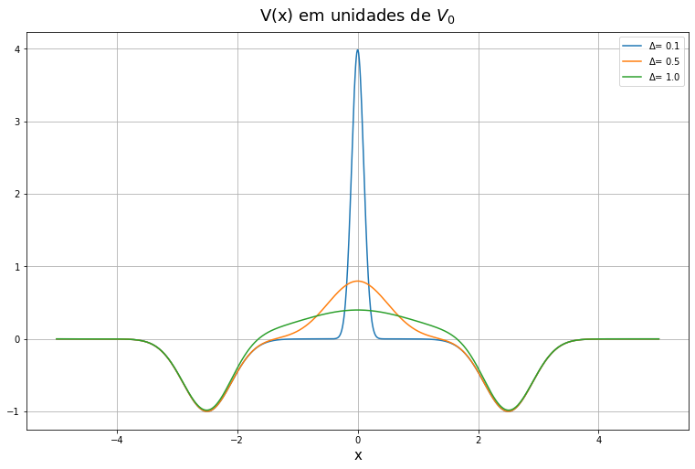

For small $\Delta$ (blue curve) the barrier is very tall — a particle at low temperature is essentially trapped in one well and cannot cross. As $\Delta$ grows the barrier flattens, the two wells merge, and the potential becomes nearly parabolic.

Since kinetic energy integrates out analytically, the equilibrium position distribution is the **Gibbs distribution**:

$$
P_{\tilde{\beta}}(x) = \frac{e^{-\tilde{\beta}\,V'(x)}}{Z(\tilde{\beta})}, \qquad \tilde{\beta} = V_0\beta,\quad V'(x) = V(x)/V_0
$$

- **High temperature** ($\tilde{\beta} \to 0$): $P \approx \text{const}$, nearly uniform.
- **Low temperature** ($\tilde{\beta}$ large): $P$ concentrates sharply on the two minima at $x = \pm 2.5$.

---

### 1.2 The Markov Chain and Metropolis Algorithm

The space is discretised with step $\delta = 0.1$, giving $N = 101$ sites. At each step the particle proposes a jump to $x' = x + k\delta$ with $k$ chosen uniformly from $\{-n,\ldots,-1,1,\ldots,n\}$. The move is accepted with the **Metropolis criterion**:

$$
A(x \to x') = \min\!\left(1,\; e^{-\tilde{\beta}\,[V'(x') - V'(x)]}\right)
$$

Downhill moves are always accepted. Uphill moves are accepted with exponentially suppressed probability — the suppression grows with $\tilde{\beta}$ (lower temperature). Moves outside $[-5,5]$ are always rejected.

The dynamics is encoded in a $101 \times 101$ **column-stochastic transition matrix** $\mathbf{M}$:

$$ M_{ij} = \left{\begin{array}{ll} \dfrac{1}{2n},A(j \to i) & \text{if } 1 \leq |i-j| \leq n \[8pt] 1 - \displaystyle\sum_{k \neq j} M_{kj} & \text{if } i = j \[8pt] 0 & \text{otherwise} \end{array}\right. $$

Each column sums to 1. The distribution evolves as $\mathbf{P}_t = \mathbf{M}^t\,\mathbf{P}_0$.

The matrix has a clear **band structure** — only nearby sites communicate in one step:

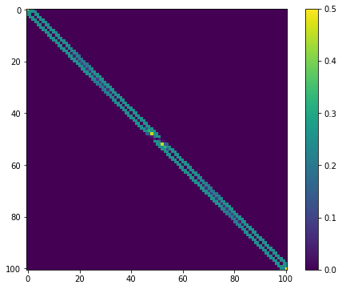

The diagonal (self-loops) is strongest near the boundaries (moves out of the box are always rejected) and in regions of high potential (uphill moves are rejected often).

---

### 1.3 Spectral Analysis of the Chain

Diagonalising $\mathbf{M}$ via `scipy.linalg.eig` gives eigenvalues $\lambda_\alpha$ and bi-orthonormal eigenvectors $\mathbf{r}_\alpha$, $\mathbf{l}_\alpha$ satisfying $\mathbf{l}_\alpha \cdot \mathbf{r}_\beta = \delta_{\alpha\beta}$. The distribution then decomposes as:

$$
\mathbf{P}_t = \mathbf{M}^t\,\mathbf{P}_0 = \sum_\alpha \lambda_\alpha^t\,(\mathbf{l}_\alpha \cdot \mathbf{P}_0)\,\mathbf{r}_\alpha
$$

**All eigenvalues have modulus $\leq 1$** — verified below for $n=1$ and $n=2$ ($\Delta = 0.01$, $\tilde{\beta} = 1$):

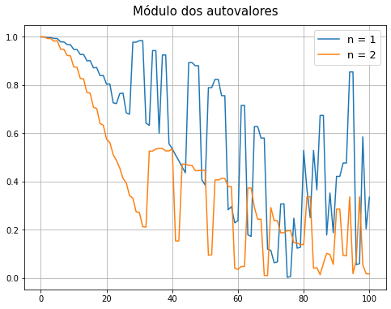

Exactly one eigenvalue equals 1 (by ergodicity). All others are strictly less than 1 in modulus and their contributions decay to zero at long times.

Bi-orthonormality $\mathbf{l}\alpha \cdot \mathbf{r}\beta = \delta_{\alpha\beta}$ is verified by computing $L^T R$ and checking it is the identity matrix.


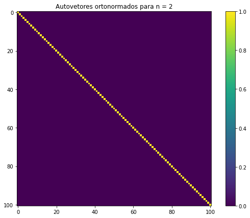

The diagonal is exactly 1 and all off-diagonal elements are $\approx 0$.

The **stationary distribution** $P_\text{eq}$ is the right eigenvector associated with $\lambda_1 = 1$. Crucially, it is **identical for $n=1$ and $n=2$**:

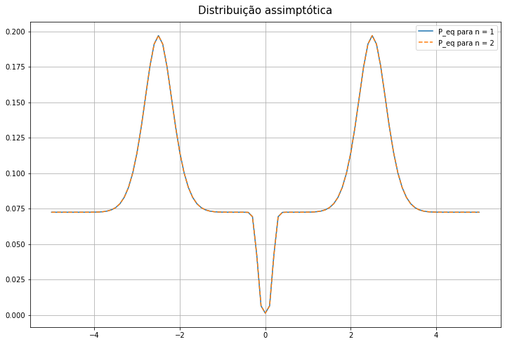

Two symmetric peaks at $x = \pm 2.5$. This confirms that the equilibrium distribution depends only on $V(x)$ and $\tilde{\beta}$, not on the neighbourhood size — dynamics changes, destination does not.

---

### 1.4 Distribution Evolution and Convergence

Starting from $P_0 = \delta_{x,2.5}$ (particle certain to be at $x = 2.5$), the chain is run for $t = 2^m$ steps with $m \in \{8,10,12,14,15\}$, at three temperatures ($n=1$, $\Delta=0.1$):

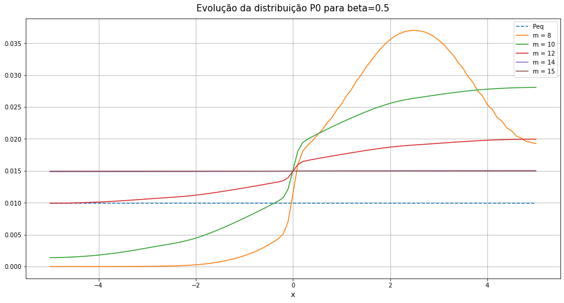

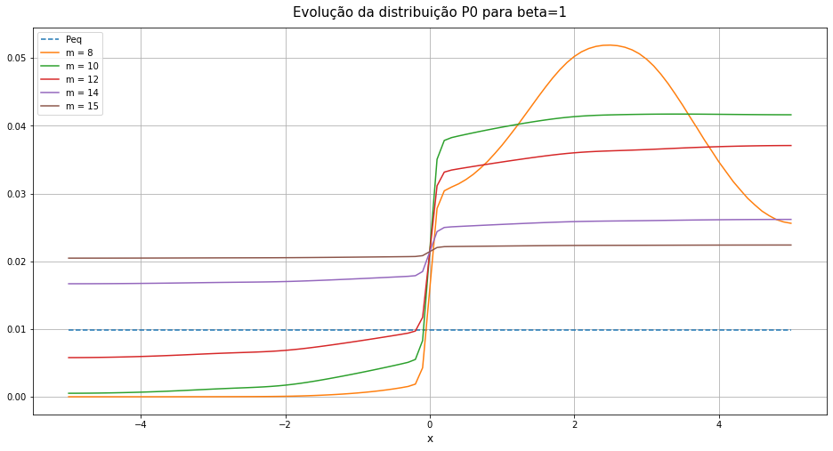

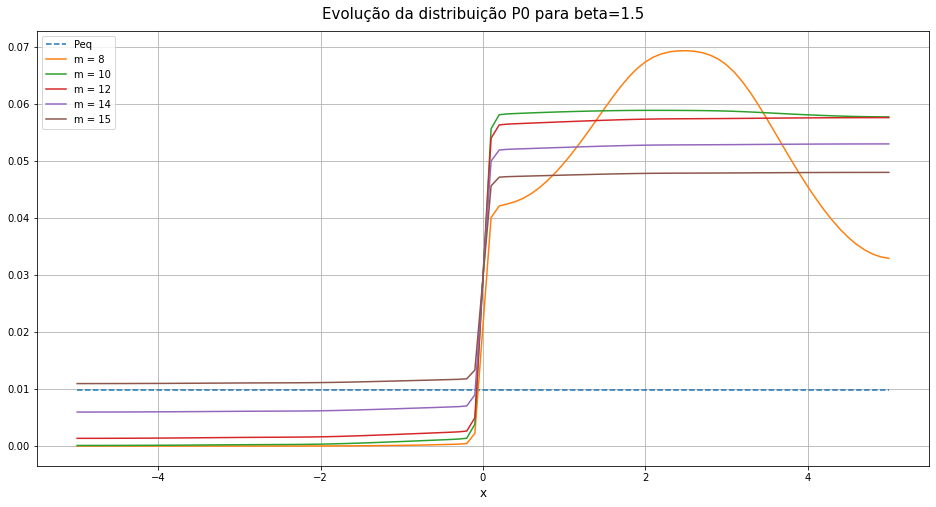

At **high temperature** ($\tilde{\beta} = 0.5$) the distribution spreads quickly and a second peak at $x = -2.5$ appears early — the barrier is easily crossed. At **low temperature** ($\tilde{\beta} = 1.5$) even at $t = 2^{15} \approx 33\,000$ steps the distribution has barely built up any weight on the other side: the particle is essentially stuck.

**Quantifying the convergence:**  the deviation from equilibrium $\Delta P_t = \max_x |P_t(x) - P_\text{eq}(x)|$ decays exponentially in the long-time limit:

$$
\Delta P_t \propto e^{-t/\tau_\text{eq}}, \qquad \tau_\text{eq} = \frac{-1}{\ln|\lambda_2|}
$$

where $\lambda_2$ is the eigenvalue with the second-largest modulus. The log-linear plots confirm this:

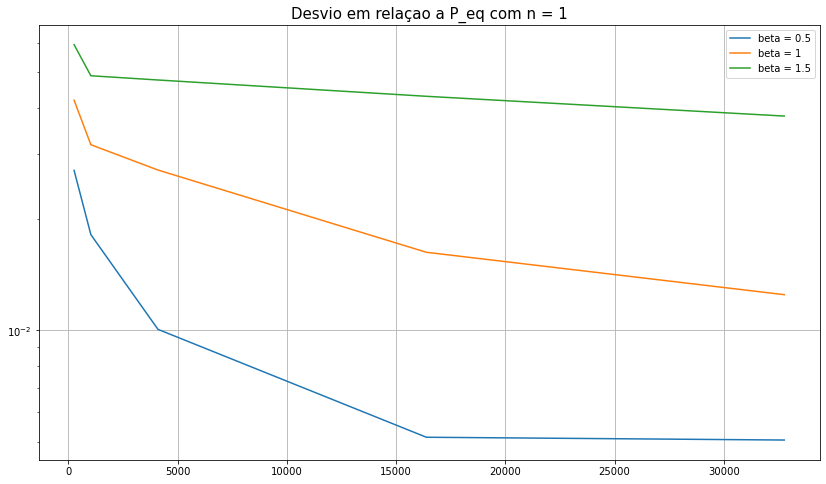

The three straight lines (log scale) confirm exponential decay. The slope (= $-1/\tau_\text{eq}$) is steepest for $\tilde{\beta} = 0.5$ and shallowest for $\tilde{\beta} = 1.5$ — lower temperature means longer equilibration. The $\tau_\text{eq}$ values extracted by `polyfit` agree with $-1/\ln|\lambda_2|$ to within a few percent.

With $n=2$ (jumps of up to 2 steps), the particle crosses the barrier more efficiently:

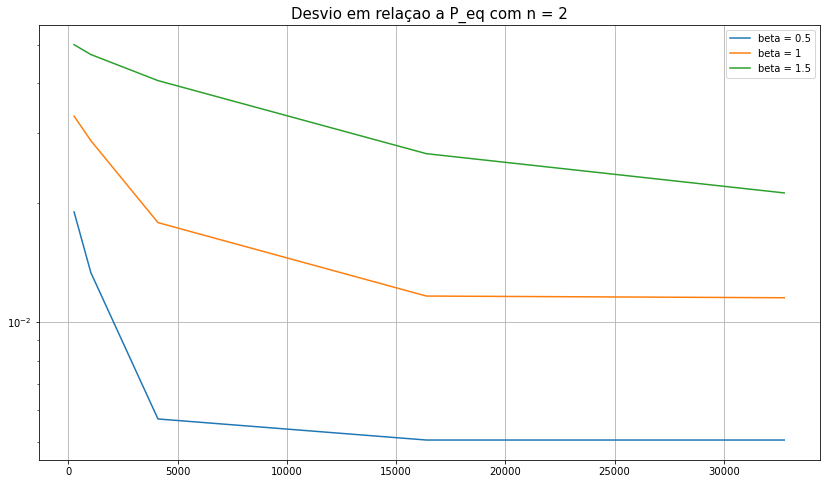

All three slopes are steeper than for $n=1$ — increasing the neighbourhood radius systematically reduces $\tau_\text{eq}$ at every temperature.

---

### 1.5 Equilibration Time as a Function of $\tilde{\beta}$ and $\Delta$

The spectral formula $\tau_\text{eq} = -1/\ln|\lambda_2|$ is computed directly from the matrix without any simulation. Scanning $\tilde{\beta}$ at fixed $\Delta = 0.1$ (for $n=1$ and $n=2$):

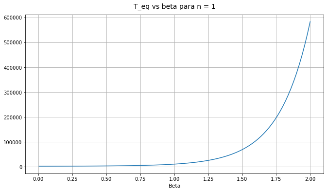

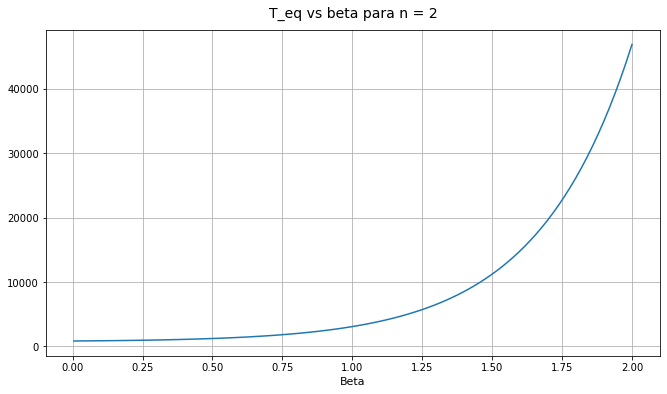

$\tau_\text{eq}$ grows approximately exponentially with $\tilde{\beta}$ — **Arrhenius behaviour**. The activation energy is set by the barrier height, which for fixed $\Delta$ is $\propto 1/\Delta$. At every $\tilde{\beta}$, the $n=2$ curve gives a smaller $\tau_\text{eq}$ than $n=1$.

Scanning $\Delta$ at fixed $\tilde{\beta} = 1$ (for $n=1$ and $n=2$):

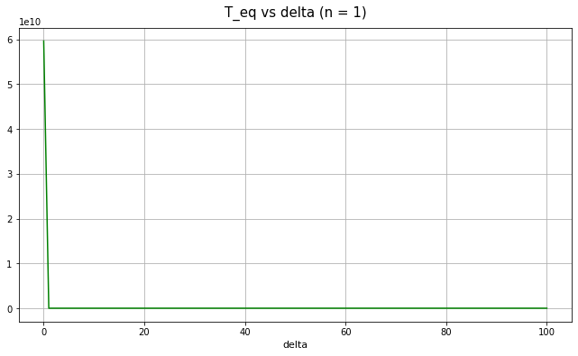

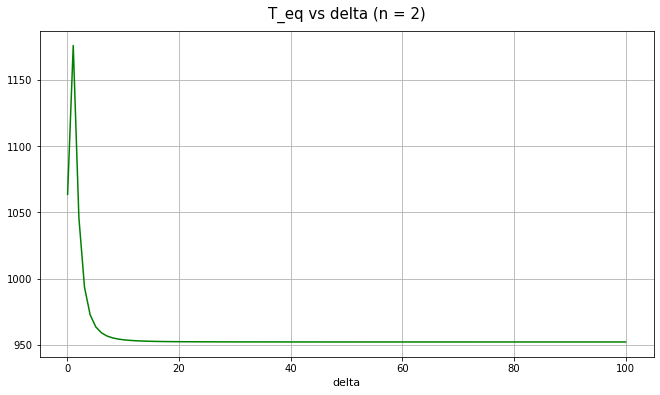

- As $\Delta \to 0$: $\tau_\text{eq} \to \infty$ because the barrier height $\propto 1/\Delta$ diverges — the chain becomes effectively absorbing.
- As $\Delta$ grows beyond the point where the barrier disappears: $\tau_\text{eq}$ drops and plateaus — no barrier to cross, equilibration is fast.
- For $n=2$ the transition to fast equilibration occurs at smaller $\Delta$ (wider jumps can bridge narrower barriers).

---

### 1.6 Symmetric Initial Condition and Two-Timescale Dynamics

Evolving $P'_0 = (\delta_{x,2.5} + \delta_{x,-2.5})/2$ — already symmetric across the two wells — with $n=1$, $\Delta = 0.01$, $\tilde{\beta} = 0.1$:

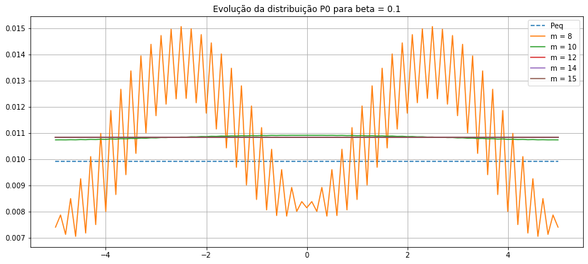

Because $\Delta$ is small the barrier is tall and the two wells are nearly decoupled. The distribution within each well equilibrates quickly (fast mode), but the weight imbalance between wells decays on a much longer timescale (slow mode). The $\tau_\text{eq}$ printed in the cell (from $\lambda_2$) captures the inter-well timescale.

---

### 1.7 The Limit $\Delta \to 0^+$ — Near-Absorbing Chain

Taking $\Delta = 0.001$ and diagonalising for $n=1$ and $n=2$:

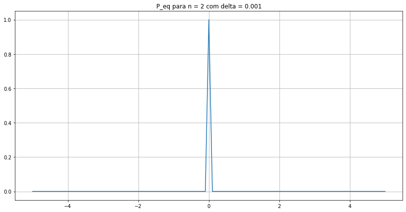

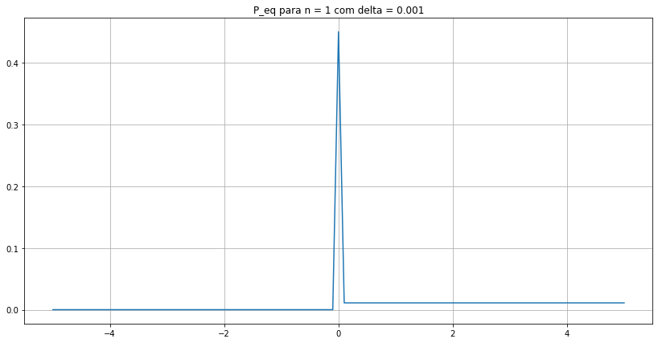

With such a narrow barrier the two wells are almost completely disconnected. For $n=1$ the stationary distribution collapses onto a **single well** — the numerical eigensolver finds one of the two (near-)degenerate eigenvectors. A second eigenvalue very close to 1 appears in the spectrum, revealing that the chain has two near-stationary distributions (one per well) and is **nearly reducible**.

For $n=2$ both wells remain visible because size-2 jumps can still bridge the near-zero-width barrier, but inter-well transitions are extremely rare.

**In the true limit $\Delta \to 0^+$:** the chain for $n=1$ becomes **reducible and absorbing** — the two wells form disconnected closed classes with no transitions between them. For $n=2$ the chain remains ergodic (just very slow) since jumps of length 2 can still cross the vanishing barrier. Both cases exhibit exponentially large $\tau_\text{eq}$.

---

## Part 2 — 2D Gas with Stochastic Collisions

### 2.1 Physical Setup

A gas of $N$ particles of mass $m = 1$ is confined to a 2D square box. **Positions are irrelevant** — only velocities matter. Two types of events happen per step:

1. **Wall collision** (probability 1%): a random particle has one velocity component negated — elastic reflection from a wall.
2. **Binary elastic collision** (probability 99%): a randomly chosen pair $(i,j)$ undergoes a collision parameterised by $\phi$.

Time is measured in collision events.

### 2.2 The Collision Model

Given velocities $\mathbf{v}_1$, $\mathbf{v}_2$ in the lab frame, the centre-of-mass (CM) velocity is:

$$
\mathbf{v}_\text{CM} = \frac{\mathbf{v}_1 + \mathbf{v}_2}{2}
$$

In the CM frame, velocities become $\mathbf{u}_i = \mathbf{v}_i - \mathbf{v}_\text{CM}$. The total momentum in this frame is zero: $\mathbf{u}_1 + \mathbf{u}_2 = \mathbf{0}$, so $\mathbf{u}_2 = -\mathbf{u}_1$. Conservation of energy then requires:

$$
|\mathbf{u}_{1,f}| = |\mathbf{u}_{1,i}|
$$

The final CM momentum lies on a circle of radius $|\mathbf{u}_{1,i}|$. The collision **rotates** $\mathbf{u}_{1,i}$ by a random angle $\theta \sim \mathcal{U}([-\phi, \phi])$, then transforms back to the lab frame. Energy and momentum are conserved exactly.

The parameter $\phi$ controls interaction strength:

| $\phi$ | Meaning |
|--------|---------|
| $0$ | No deflection — particles pass through each other |
| Small | Weak interaction — small random rotation |
| $1.0$ | Moderate deflection |
| $\pi$ | Maximum randomisation — outgoing direction uniform in $[-\pi,\pi]$ |

### 2.3 Velocity dynamics

Simulating $N=30$, $E=10$, $\phi=0.1$, over $10^4$ collisions, the velocity $v_x$ of all 30 particles is tracked:

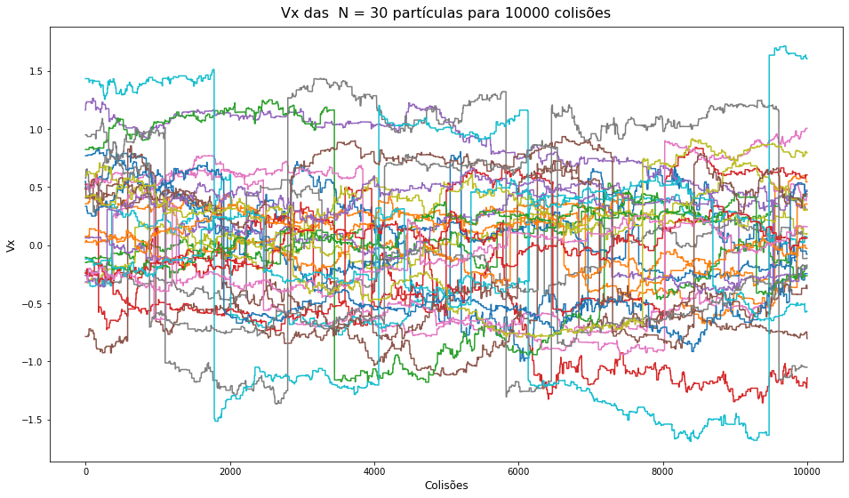

Segments where $v_x$ is constant: no collision involving that particle. **Sharp vertical jumps**: wall collisions (one component inverted instantaneously). **Gradual changes**: inter-particle collisions with small $\phi$ — the momentum rotates only slightly per event.

### 2.4 Approach to Equilibrium: Maxwell-Boltzmann Distribution

After $10^5$ collisions, the histogram of $v_x$ of a single particle:

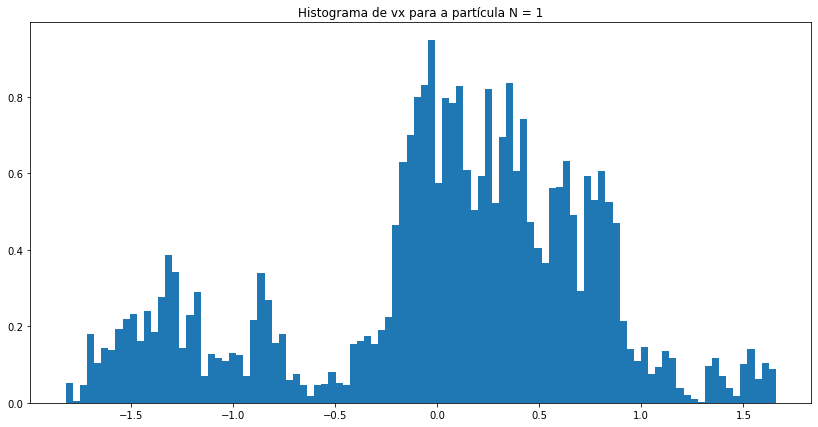

The distribution is approximately Gaussian with $\sigma \approx \sqrt{E/N} = \sqrt{1/3} \approx 0.58$, consistent with the **Maxwell-Boltzmann distribution** at temperature $k_BT = E/N$.

For an ideal gas in 2D, the expected equilibrium velocity distribution for each component is:

$$
f(v_x) = \frac{1}{\sqrt{2\pi\,k_BT}}\,e^{-v_x^2/(2k_BT)}
$$

To see the **approach** to this distribution, 300 independent initialisations are averaged and histograms are computed at $t = 10, 20, 30, 40, 50$ collisions ($\phi = 1.0$):

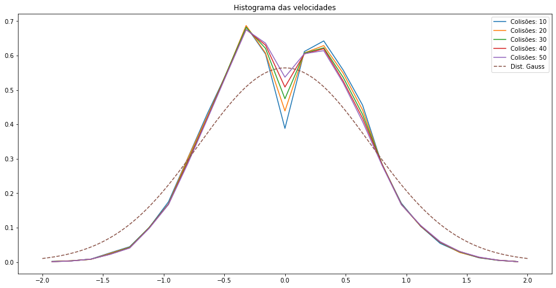

At $t = 10$ the distribution has a dip near $v_x = 0$ (an artefact of the initial velocity generation). As collisions accumulate the dip fills in and by $t = 50$ the distribution is very close to the theoretical Gaussian (dashed). With $\phi = 1.0$ each collision provides substantial randomisation, so convergence is fast.

### 2.5 Effect of Interaction Strength $\phi$

The same analysis is repeated for $\phi \in \{0,\,0.1,\,1.0,\,\pi\}$ at times $t \in \{0,\,40,\,80,\,160,\,200\}$:

**$\phi = 0$ — no interaction:**

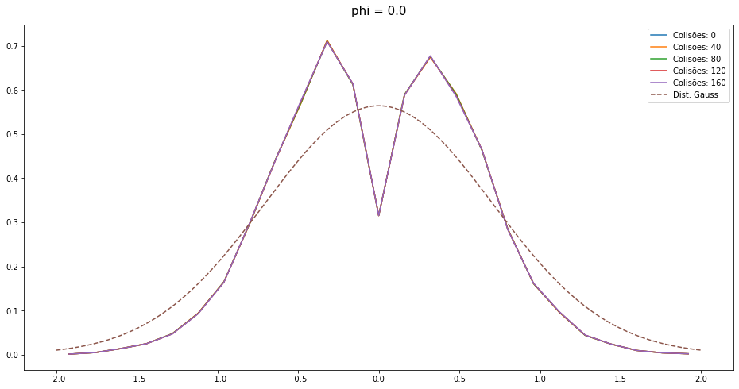

The distribution does not change at all — every collision rotates the momentum by zero, leaving velocities unchanged. No thermalisation without interaction.

**$\phi = 0.1$ — weak interaction:**

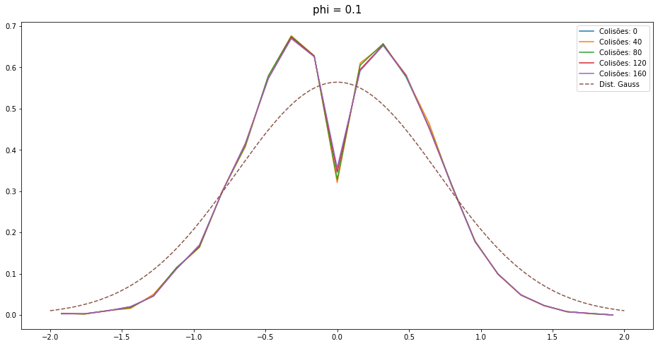

Slow convergence. Even at $t = 200$ the distribution has not fully reached the Gaussian — the dip near 0 partially persists. Small deflections per collision mean many events are needed to redistribute velocities.

**$\phi = 1.0$ — moderate interaction:**

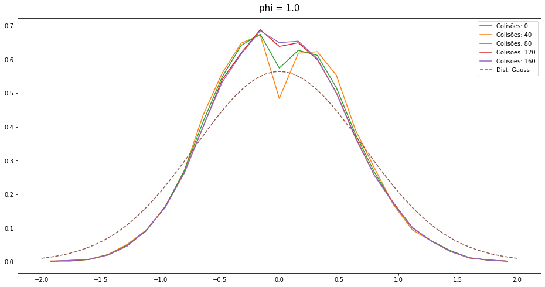

Clear convergence by $t \approx 80$. The curves at 80, 160 and 200 are nearly indistinguishable from the Gaussian.

**$\phi = \pi$ — maximum randomisation:**

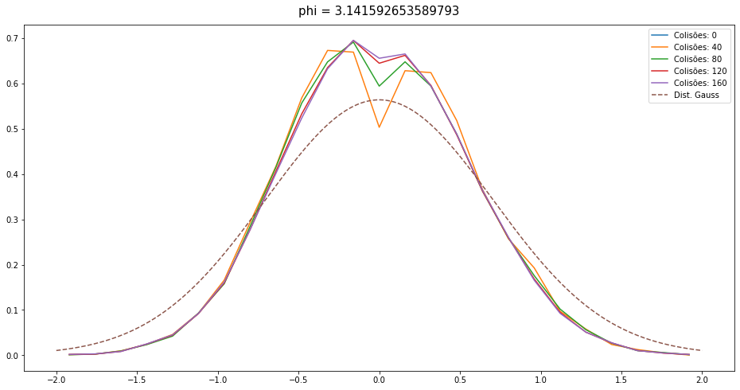

Already at $t = 40$ the distribution is essentially Gaussian. Each collision fully randomises the direction of relative momentum, maximising the information erased per event.

### 2.6 Emergence of the Boltzmann Distribution

For small $N$ the single-particle energy distribution deviates from the canonical exponential. In the microcanonical ensemble with $N$ particles and total energy $E$, the exact distribution of one particle's energy $\varepsilon_1$ is:

$$
P(\varepsilon_1) \propto \left(1 - \frac{\varepsilon_1}{E}\right)^{N-2} \xrightarrow[]{N \to \infty} e^{-\varepsilon_1 N/E} = e^{-\varepsilon_1/k_BT}
$$

This convergence to the Boltzmann exponential as $N$ grows is the statistical mechanics content of the **canonical ensemble emerging from the microcanonical one**: the remaining $N-1$ particles act as a heat bath for particle 1 only when $N$ is large enough.

Simulating $10^5$ collisions for $N \in \{3,\,5,\,11,\,17\}$ with $\phi = 1.0$, $E = 10$:

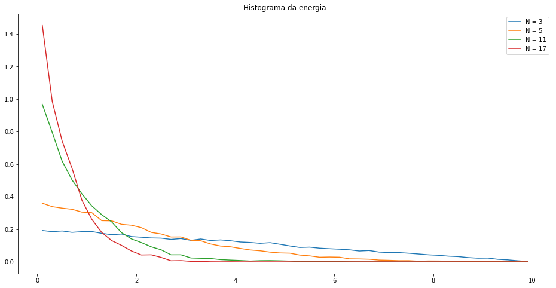

- **$N = 3$**: the distribution is broad and non-exponential — finite-size effects dominate.
- **$N = 5$**: exponential tail begins to emerge.
- **$N = 11, 17$**: curves are well-approximated by $P(\varepsilon) \propto e^{-\varepsilon N/E}$, converging to the Boltzmann distribution.
- The mean energy per particle $\langle \varepsilon_1 \rangle = E/N$ decreases as $N$ grows — the same total energy is split among more particles, making each individual one "colder".

---

## Key Results

### Part 1

| Result | Explanation |
|--------|-------------|
| $P_\text{eq}$ independent of $n$ | Equilibrium depends only on $V(x)$ and $\tilde{\beta}$, not on the dynamics |
| $\tau_\text{eq}$ grows exponentially with $\tilde{\beta}$ | Arrhenius law: barrier crossing becomes exponentially rare at low temperature |
| $\tau_\text{eq}$ smaller for $n=2$ | Larger jumps explore space more efficiently |
| $\tau_\text{eq} = -1/\ln\|\lambda_2\|$ confirmed | Spectral formula and `polyfit` on $\ln\Delta P_t$ agree |
| Chain becomes absorbing as $\Delta \to 0$ | Barrier height diverges, two wells become disconnected |

### Part 2

| Result | Explanation |
|--------|-------------|
| Maxwell-Boltzmann emerges from stochastic collisions | Any $\phi > 0$ eventually thermalises the system |
| Larger $\phi$ → faster thermalisation | More randomisation per collision → faster information loss |
| $\phi = 0$ → no thermalisation | Without deflection, velocities are conserved per particle |
| Boltzmann distribution emerges at large $N$ | Single particle sees $N-1$ particles as a thermal reservoir |
